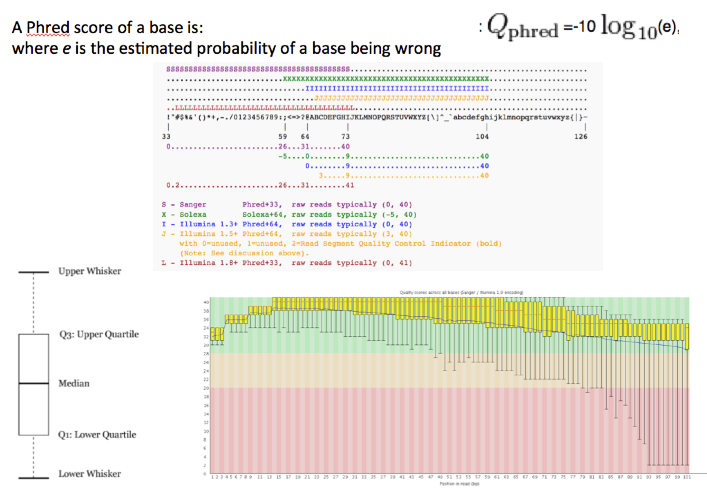
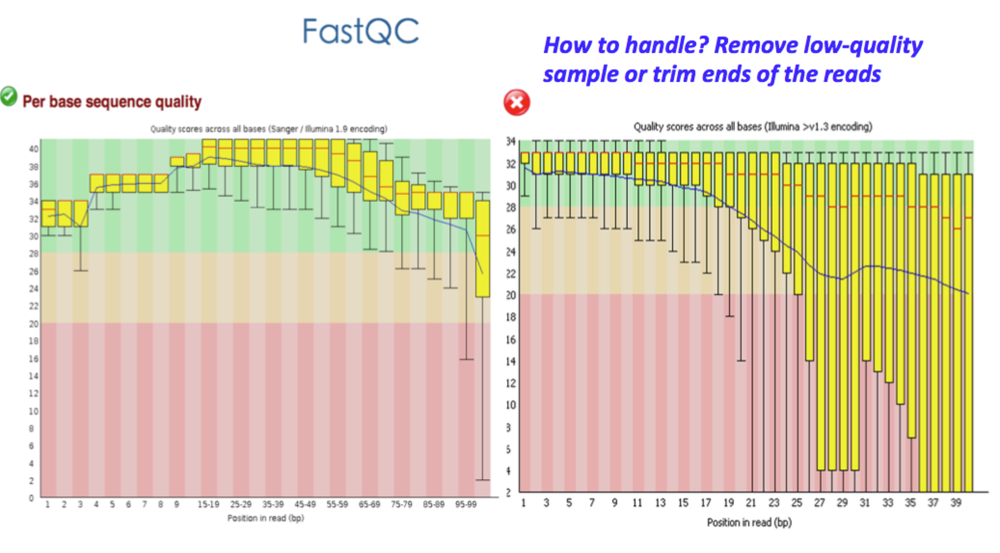
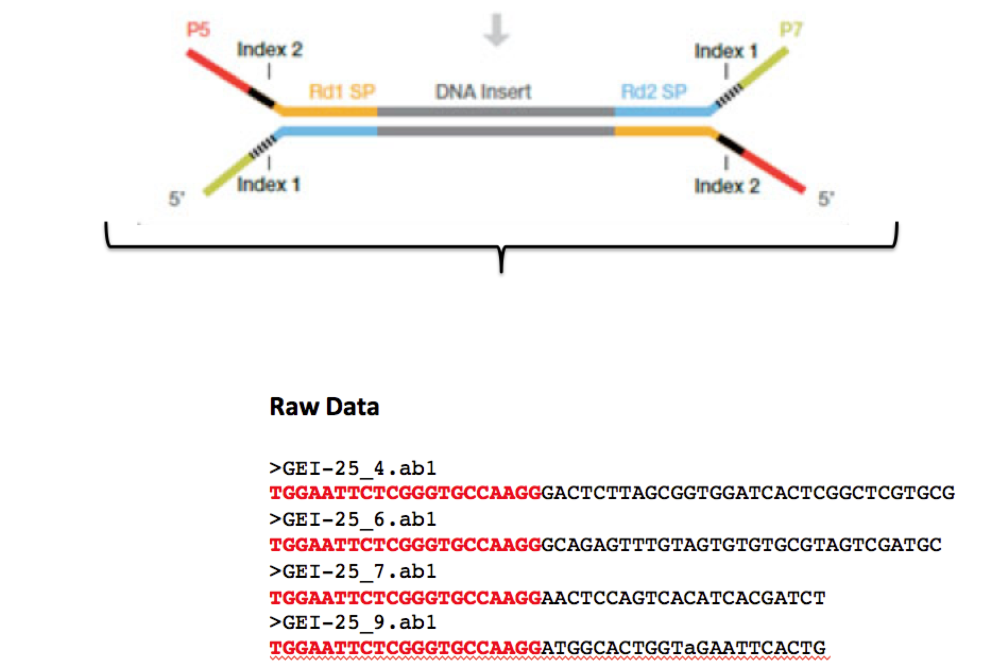
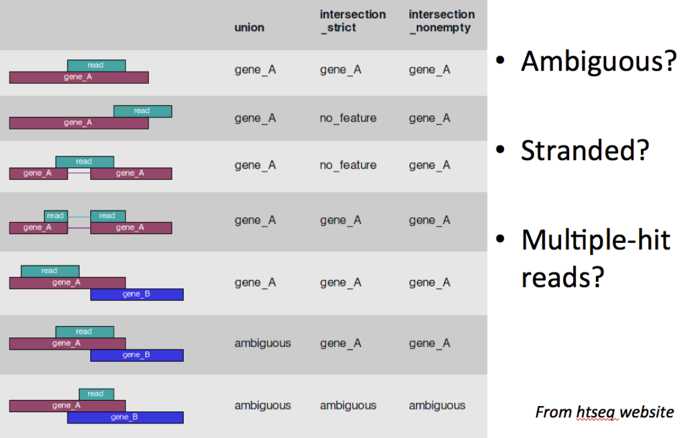
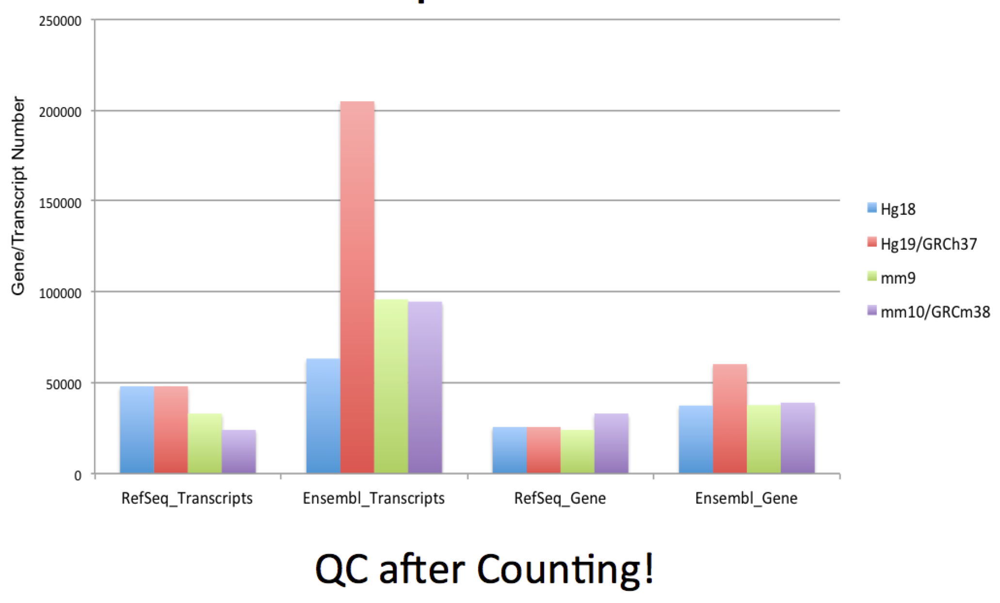
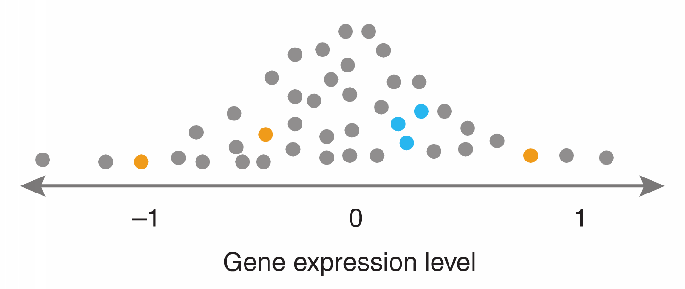
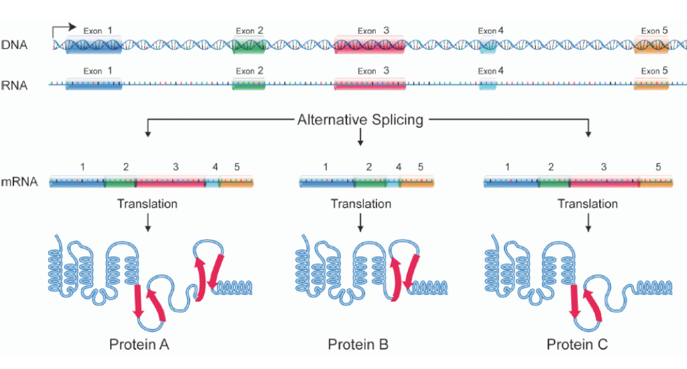

## Introduction to RNA-seq Data Analysis 
<small> Our practice in [Ciaudo Lab ](http://www.mhs.biol.ethz.ch/research/ciaudo.html) </small> 
<h1> </h1> 
<small> Jian Yu </small>

  
*** =pnotes

Some notes on the first slide

--- 

## Introduction
> - What is RNA-seq?
  - <small> Using next-generation sequencing (NGS) to reveal the presence and quantity of RNA in a biological sample at a given moment </small> 
<h1> </h1>   
> - Bulk mRNA-seq 
<h1> </h1>   
> - Advantages
   - <small> High sensitivity </small> 
   - <small> Unbiased </small> 
   - <small> Novel transcripts </small> 

---

## Formulate your question

> - Two group comparison: WT vs KO 
<h1> </h1>  
> - Nested Design: Treatment effect in different cancer subtypes
<h1> </h1>  
> - Time series: Gene expression pattern along embryonic development

---

## Discussion
> - With your PI: budget, schedule 
<h1> </h1>  
> - Sequencing facility: protocol, timeslot, quotation 
<h1> </h1>  
> - IT support: data transimisson/storage 
<h1> </h1>  
> - Bioinformaticians: experiment design, data analysis 

---
## Experiment Design  
> -  What is your biological interest?
  - <small> Differentially Expressed Genes/Transcripts? </small>
  - <small> Differential Splicing Events? </small>
  - <small> Noncoding RNAs? </small>
  - <small> Fusion Transcripts? </small>
<h1> </h1>    
> - Paired sample?
<h1> </h1>  
> - Batch Effect?
<h1> </h1>  
> - How many replicates? 3?

---
## Protocol Choice
> - PolyA/Ribosome-? 
<h1> </h1>  
> - Single-end/Paired-end? 
<h1> </h1>  
> - Stranded/Non-stranded?
<h1> </h1>  
> - Read Size?
<h1> </h1>  
> - Sequencing Depth?

---
## Case Report
> - Experiment Design: Hepatocellular Carcinoma, 4 samples
<h1> </h1>  
> - Interesting points: point mutation in mRNA, miss-regulated genes, and choromosome re-arrangments
<h1> </h1>  
> - Add adjacent tissue as paired controls
<h1> </h1>  
> - Double sequencing depth, and switch to paired-end
<h1> </h1>  
> - Increasing sample size from 4 to 12

---
## Quality Check
[FastQC](http://www.bioinformatics.babraham.ac.uk/projects/fastqc/)
<h1> </h1>

---
## Quality Check

---
## Quality Check

<h1> </h1>
[Trimmomatic](http://www.usadellab.org/cms/index.php?page=trimmomatic)

---
## Preprocessing 

---
## Data Preprocessing is __Essential__
> - Bad Data often present
- Low-quality sequence (artifacts)
- Adapter Contamination

> - Analysis of bad data should be avoided
- Is expensive: computing + man power
- Can compromise downstream analysis

---
## Mapping 

---
## Mapping 
For RNA-seq, gaps and mismatches should be allowed

> - QC after mapping

> - [STAR](https://github.com/alexdobin/STAR)

---
## Counting: [FeatureCounts](http://bioinf.wehi.edu.au/featureCounts/)

---
## Choice of Gene Model: Ensembl

---
## Statistical Modeling
> - There is no <q>correct model</q>
  
> - Models are approximations of the truth

> - There is a <q>useful model</q>
  
> - Understanding the mechanisms of the system for better choices of model alternatives

---
  
## Statistical Modeling
> - Negative Binomial Model

> - Shrinkage is necessary

---
  
## Statistical Modeling
> - [DESeq2](https://bioconductor.org/packages/release/bioc/html/DESeq2.html)

> - Shrinkage
  
> - Complex Experiment Design

> - Single Replicate

> - Outlier Detection

> - Independent Filtering

---
## Multiple Testing Correction
> - We are doing high-throughput experiments which compare thousands of units simultaneously

> - At this scale, rare events could happen _just by chance_
- Event A: 1 in 1000 chance of happening (p=`r 0.001`)
- And the statistical test performed for `r 20000` times
- `r 20000*0.001` occurrence of false positives, even though using a <q>very strict</q> p-value

> - __NEVER BELIEVE__  raw p-value in high-throughput experiments, use adjusted P-value or FDR

---
## Alternative Splicing

---
 
## Alternative Splicing
> - Isoform-centric

> - Exon-centric: [DEXSeq](http://bioconductor.org/packages/release/bioc/html/DEXSeq.html)

---
  
## A Working Pipeline
> - [FASTQC](http://www.bioinformatics.babraham.ac.uk/projects/fastqc/): Quality Control
> - [Trimmomatic](http://www.usadellab.org/cms/index.php?page=trimmomatic): Adaptor Removal
> - [STAR](https://github.com/alexdobin/STAR): Mapping
> - [FeatureCounts](http://bioinf.wehi.edu.au/featureCounts/): Counting
> - [DESeq2](https://bioconductor.org/packages/release/bioc/html/DESeq2.html): Differential Expression
> - [DEXSeq](http://bioconductor.org/packages/release/bioc/html/DEXSeq.html): Differential Splicing

---
## THANKS FOR YOUR ATTENTION
acknowledgements: 
- SIS, Michal Okoniewski, 
- [Ciaudo Lab ](http://www.mhs.biol.ethz.ch/research/ciaudo.html)

  
  

